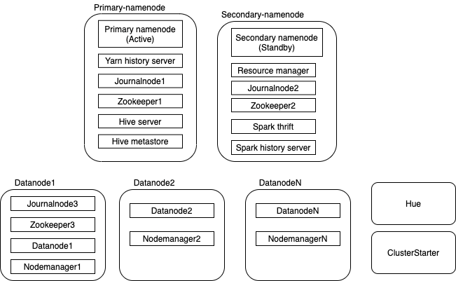

# Docker hadoop spawningpool
This is local docker hadoop cluster builder for robust Hadoop apps test.
You can construct fully distributed Hadoop cluster on local by this script.
This project itself doesn't contain any docker image, but it will generate/download required files, and set up hadoop ecosystems.  
Basically this is for Hadoop or Hadoop ecosystem apps test on your local with fully distributed hadoop system.  

# Prerequisite
- Python3
- Docker

# How to start
```bash
$ pip install -r requirements
$ python main.py {options}
$ cd target
$ sh ./bin/builder.sh all  # Build Hadoop and starter image
$ docker-compose up -d
```
After run above command, Python script will download Hadoop, Hive, Spark binaries and then generate Dockerfile and required bash script files under `target` directory.
It will take time as binaries are quite Huge.  
Once it's done, you can run `builder.sh` and run `docker-compose up -d`.
Finally you can see the all cluster up after 3~5min once you run the command(you may have to wait for more)  
You can check following addresses.

|  Component  |  Address  |
|-----------|---------|
|  Yarn resource manager  |  localhost:8088  |
|  Namenode(active)  |  localhost:9870  |
|  Namenode(active)  |  localhost:9870  |
|  Namenode(standby)  |  localhost:9871  |
|  Datanode  |  localhost:9864, 9865, ...  |
|  HiveServer  |  localhost:10002  |
|  Hue  |  localhost:8888 |


# Options
1. `--num-datanode` 
Number of datanode that you want to use. default 3
   
2. `--hive`
Enable Hive. Hive docker instance will be included in an instance.
   
3. `--hue`
Enable Hue. Hue docker instance will be included in an instance.
   
4. `--spark-history`
Enable spark history server. Spark history instance will be included in an instance.
   
5. `--spark-thrift`
Enable spark thrift server. Spark thrift server will be included in an instance.
   
# Example
```bash
$ python main.py --num-datanode 3 --hive --hue --spark-history --spark-thrift
```

# Supported tech stack and version
|  name | version |        | 
|---------|---------|-------|
|  Hadoop | 3.3.0 |     |
|  Hive   | 3.1.2 |      |
|  Spark  | 3.1.2 | Scala 2.13    |
|  Hue    | 4.9.0 |  Not verfied to work yet(will fix soon)   |


# Local docker cluster overview
## Instances

Basically instance overview consists of above image
- Instance `primary-namenode` contains active namenode, yarn history server, journalnode, zookeeper and optionally Hive server and metastore.
- Instance `secondary-namenode` contains standby namenode, resource manager, journal node, zookeeper and optionally spark thrift and history server.
- Instance `Datanode1` contains journalnode, zookeeper, datanode and node manager.
- If you specify `--num-datanode` more than 1, additional datanode will be instantiated.
- If user specify `--hue`, Hue instance will be added
- Cluster starter is temporary instantiated, it loads all hadoop components and prepare all initial state in order. After All cluster are ready to serve, Cluster starter is terminated.


# Road map 
- Support Presto
- Support Kafka
- Support Airflow or Oozie
- Support Sqoop
- Support various version of each framework
